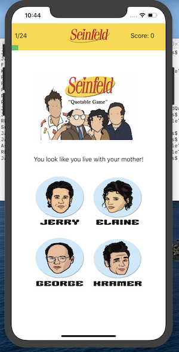

# SeinfieldQuotableTrivia

## Description

The Seinfeld Trivia App Consists of 25 questions/quotes (at the moment). Users have to guess who said the statement in show.
There are four choices from the main characters(Jerry, Elaine, George, Kramer).

## Code Snippet

```swift

func updateQuote(){
        
        if quoteNumber <= allQuestions.list.count - 1{
            
            adjust()

            quoteLabel.text = allQuestions.list[quoteNumber].question
            optionA.setTitle(allQuestions.list[quoteNumber].optionA, for: UIControl.State.normal)
            optionB.setTitle(allQuestions.list[quoteNumber].optionB, for: UIControl.State.normal)
            optionC.setTitle(allQuestions.list[quoteNumber].optionC, for: UIControl.State.normal)
            optionD.setTitle(allQuestions.list[quoteNumber].optionD, for: UIControl.State.normal)
            selectedAnswer = allQuestions.list[quoteNumber].correctAnswer
            updateUI()
            
        }else {
            let alert = UIAlertController(title: "Nice Job 👍🏽", message: "End of Game. Start Again?", preferredStyle: .alert)
            
            let restartAction = UIAlertAction(title: "Restart", style: .default, handler: {action in self.restartGame()})
            
            alert.addAction(restartAction)
            present(alert, animated: true, completion: nil)
        }
        
        
    }

```


